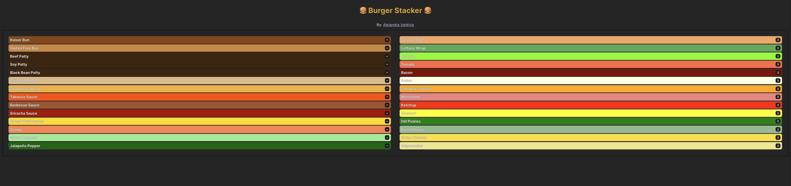

## Lifting State in React Lab

To get started, clone this repository at https://github.com/AlejandraValdivia/lifting-state-in-react-lab and run `npm install` and `npm run dev`.

Go to http://localhost:5173 to see your first React application and create your perfect burger with your favorite ingredients clicking on the `+` button and if you want to remove an ingredient click on the `X`.

